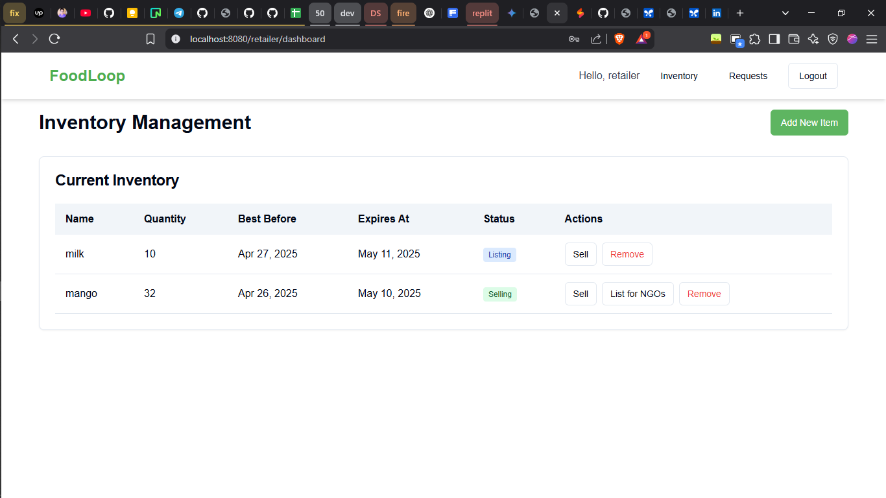

# FoodLoop - Connecting Retailers and NGOs to Reduce Food Waste


Got it! Here’s the improved version of your `README.md` following your preferred structure—narrative-first, then screenshots in a natural flow without using tables. This version builds the story of the platform progressively, starting with the homepage, moving through authentication, and then diving into the user-specific dashboards (Retailers first, then NGOs).

---

# 🥗 FoodLoop – Bridging Surplus Food with Community Needs

**FoodLoop** is a web platform that connects food retailers with nearby NGOs to reduce food waste and support communities. Retailers can list surplus food that would otherwise go to waste, and NGOs can request or claim it to help those in need.

---

## 🏠 Homepage

The homepage introduces users to the purpose of FoodLoop—highlighting how the platform connects surplus food from retailers with NGOs in the same locality (based on pincode). The design is clean, intuitive, and encourages users to log in or sign up to start contributing.


---

## 🔐 Authentication

FoodLoop features a secure authentication system using JSON Web Tokens (JWT). Both Retailers and NGOs can register and log in through a simple UI, after which they’re redirected to their respective dashboards based on their role.

### 🔓 Login Page

Users can sign in securely to access their dashboard.


### 📝 Sign Up Page

New users can register as either a Retailer or NGO. During sign-up, users provide basic details including their pincode, which is used to match them with nearby listings or requests.


---

## 🏪 Retailer Dashboard

Once logged in, **Retailers** can access a dashboard that gives them full control over their inventory and allows them to respond to requests from nearby NGOs.

### 📊 Retailer Overview

The dashboard provides a summary of current inventory, items listed for donation, and incoming requests from NGOs.


### 📦 Inventory Management

Retailers can add, update, list, or mark items as sold. Each inventory item displays essential information including the food name, purchase date, best-before date, and expiration date. 

Retailers can also "List" an item for NGOs or mark it as "Sold" to remove it from circulation.



### 📥 NGO Food Requests

Retailers can also view a list of food requests submitted by NGOs in the same pincode and choose to connect with them.


---

## 🏥 NGO Dashboard

NGOs have their own tailored dashboard that helps them view surplus food available nearby and submit requests for food items they need.

### 🧭 NGO Dashboard View

Upon logging in, NGOs can immediately see food items listed by retailers in their pincode area. Each card shows the food item’s name, condition, and other key details.


### 🛍️ Available Food Items

NGOs can browse through listed food and use the "Contact" button to reach out to retailers for pickup or delivery coordination.


---

## 🧾 Tech Stack

- **Frontend:** React, Shadcn UI  
- **Backend:** Flask (Python)  
- **Authentication:** JWT (JSON Web Tokens)

---

## 🚀 Getting Started (Conceptual)

This section outlines the setup at a high level. For complete setup instructions, refer to the full repository documentation.

### Backend Setup

```bash
cd backend
pip install -r requirements.txt
flask run
```

### Frontend Setup

```bash
cd frontend
npm install
npm start
```

Or with Yarn:

```bash
yarn install
yarn start
```

Visit `http://localhost:3000` to view the app.

---

## 🔌 API Overview

### Auth

- `POST /sign-up` – Register a new user  
- `POST /auth-login` – Authenticate and receive JWT token  

### Retailer Routes

- `GET /retailers/inventory` – View inventory  
- `POST /retailers/add_item` – Add a new item  
- `POST /retailers/inventory/<id>/list` – List item for NGOs  
- `POST /retailers/inventory/<id>/sell` – Mark item as sold  
- `DELETE /retailers/item/remove/<id>` – Remove item  
- `POST /retailers/predict_dates` – *(Conceptual)* Predict best-before/expiration using Gemini API  

### NGO Routes

- `GET /ngo/filtered_food` – View listed food nearby  
- `POST /ngo/request` – Submit a new food request  

---

## 🔮 Future Enhancements

- Expiration date prediction using AI (Gemini API)
- Real-time notifications for matches between retailers and NGOs
- Admin panel for moderation and reporting
- Geolocation map-based discovery

---

## 🤝 Contributing

Open to pull requests and collaboration! If you want to add features or fix bugs, please fork the repo and submit a PR.

---

Let me know if you'd like this in a downloadable `.md` file format or published as part of your repo!Got it! Here’s the improved version of your `README.md` following your preferred structure—narrative-first, then screenshots in a natural flow without using tables. This version builds the story of the platform progressively, starting with the homepage, moving through authentication, and then diving into the user-specific dashboards (Retailers first, then NGOs).

---

# 🥗 FoodLoop – Bridging Surplus Food with Community Needs

**FoodLoop** is a web platform that connects food retailers with nearby NGOs to reduce food waste and support communities. Retailers can list surplus food that would otherwise go to waste, and NGOs can request or claim it to help those in need.

---

## 🏠 Homepage

The homepage introduces users to the purpose of FoodLoop—highlighting how the platform connects surplus food from retailers with NGOs in the same locality (based on pincode). The design is clean, intuitive, and encourages users to log in or sign up to start contributing.


---

## 🔐 Authentication

FoodLoop features a secure authentication system using JSON Web Tokens (JWT). Both Retailers and NGOs can register and log in through a simple UI, after which they’re redirected to their respective dashboards based on their role.

### 🔓 Login Page

Users can sign in securely to access their dashboard.


### 📝 Sign Up Page

New users can register as either a Retailer or NGO. During sign-up, users provide basic details including their pincode, which is used to match them with nearby listings or requests.


---

## 🏪 Retailer Dashboard

Once logged in, **Retailers** can access a dashboard that gives them full control over their inventory and allows them to respond to requests from nearby NGOs.

### 📊 Retailer Overview

The dashboard provides a summary of current inventory, items listed for donation, and incoming requests from NGOs.


### 📦 Inventory Management

Retailers can add, update, list, or mark items as sold. Each inventory item displays essential information including the food name, purchase date, best-before date, and expiration date. A color-coded dot helps track the condition of the food:

- 🟢 Green: Fresh (before best-before date)
- 🟡 Yellow: Still consumable, should be listed for NGOs
- 🔴 Red: Possibly expired

Retailers can also "List" an item for NGOs or mark it as "Sold" to remove it from circulation.


### 📥 NGO Food Requests

Retailers can also view a list of food requests submitted by NGOs in the same pincode and choose to connect with them.


---

## 🏥 NGO Dashboard

NGOs have their own tailored dashboard that helps them view surplus food available nearby and submit requests for food items they need.

### 🧭 NGO Dashboard View

Upon logging in, NGOs can immediately see food items listed by retailers in their pincode area. Each card shows the food item’s name, condition, and other key details.


### 🛍️ Available Food Items

NGOs can browse through listed food and use the "Contact" button to reach out to retailers for pickup or delivery coordination.


---

## 🧾 Tech Stack

- **Frontend:** React, Shadcn UI  
- **Backend:** Flask (Python)  
- **Authentication:** JWT (JSON Web Tokens)

---

## 🚀 Getting Started (Conceptual)

This section outlines the setup at a high level. For complete setup instructions, refer to the full repository documentation.

### Backend Setup

```bash
cd backend
pip install -r requirements.txt
flask run
```

### Frontend Setup

```bash
cd frontend
npm install
npm start
```

Or with Yarn:

```bash
yarn install
yarn start
```

Visit `http://localhost:3000` to view the app.

---

## 🔌 API Overview

### Auth

- `POST /sign-up` – Register a new user  
- `POST /auth-login` – Authenticate and receive JWT token  

### Retailer Routes

- `GET /retailers/inventory` – View inventory  
- `POST /retailers/add_item` – Add a new item  
- `POST /retailers/inventory/<id>/list` – List item for NGOs  
- `POST /retailers/inventory/<id>/sell` – Mark item as sold  
- `DELETE /retailers/item/remove/<id>` – Remove item  
- `POST /retailers/predict_dates` – *(Conceptual)* Predict best-before/expiration using Gemini API  

### NGO Routes

- `GET /ngo/filtered_food` – View listed food nearby  
- `POST /ngo/request` – Submit a new food request  

---

## 🔮 Future Enhancements

- Expiration date prediction using AI (Gemini API)
- Real-time notifications for matches between retailers and NGOs
- Admin panel for moderation and reporting
- Geolocation map-based discovery

---

## 🤝 Contributing

Open to pull requests and collaboration! If you want to add features or fix bugs, please fork the repo and submit a PR.

---

Let me know if you'd like this in a downloadable `.md` file format or published as part of your repo!Got it! Here’s the improved version of your `README.md` following your preferred structure—narrative-first, then screenshots in a natural flow without using tables. This version builds the story of the platform progressively, starting with the homepage, moving through authentication, and then diving into the user-specific dashboards (Retailers first, then NGOs).

---

# 🥗 FoodLoop – Bridging Surplus Food with Community Needs

**FoodLoop** is a web platform that connects food retailers with nearby NGOs to reduce food waste and support communities. Retailers can list surplus food that would otherwise go to waste, and NGOs can request or claim it to help those in need.

---

## 🏠 Homepage

The homepage introduces users to the purpose of FoodLoop—highlighting how the platform connects surplus food from retailers with NGOs in the same locality (based on pincode). The design is clean, intuitive, and encourages users to log in or sign up to start contributing.


---

## 🔐 Authentication

FoodLoop features a secure authentication system using JSON Web Tokens (JWT). Both Retailers and NGOs can register and log in through a simple UI, after which they’re redirected to their respective dashboards based on their role.

### 🔓 Login Page

Users can sign in securely to access their dashboard.


### 📝 Sign Up Page

New users can register as either a Retailer or NGO. During sign-up, users provide basic details including their pincode, which is used to match them with nearby listings or requests.


---

## 🏪 Retailer Dashboard

Once logged in, **Retailers** can access a dashboard that gives them full control over their inventory and allows them to respond to requests from nearby NGOs.

### 📊 Retailer Overview

The dashboard provides a summary of current inventory, items listed for donation, and incoming requests from NGOs.


### 📦 Inventory Management

Retailers can add, update, list, or mark items as sold. Each inventory item displays essential information including the food name, purchase date, best-before date, and expiration date. A color-coded dot helps track the condition of the food:

- 🟢 Green: Fresh (before best-before date)
- 🟡 Yellow: Still consumable, should be listed for NGOs
- 🔴 Red: Possibly expired

Retailers can also "List" an item for NGOs or mark it as "Sold" to remove it from circulation.


### 📥 NGO Food Requests

Retailers can also view a list of food requests submitted by NGOs in the same pincode and choose to connect with them.


---

## 🏥 NGO Dashboard

NGOs have their own tailored dashboard that helps them view surplus food available nearby and submit requests for food items they need.

### 🧭 NGO Dashboard View

Upon logging in, NGOs can immediately see food items listed by retailers in their pincode area. Each card shows the food item’s name, condition, and other key details.


### 🛍️ Available Food Items

NGOs can browse through listed food and use the "Contact" button to reach out to retailers for pickup or delivery coordination.


---

## 🧾 Tech Stack

- **Frontend:** React, Shadcn UI  
- **Backend:** Flask (Python)  
- **Authentication:** JWT (JSON Web Tokens)

---

## 🚀 Getting Started (Conceptual)

This section outlines the setup at a high level. For complete setup instructions, refer to the full repository documentation.

### Backend Setup

```bash
cd backend
pip install -r requirements.txt
flask run
```

### Frontend Setup

```bash
cd frontend
npm install
npm start
```

Or with Yarn:

```bash
yarn install
yarn start
```

Visit `http://localhost:3000` to view the app.

---

## 🔌 API Overview

### Auth

- `POST /sign-up` – Register a new user  
- `POST /auth-login` – Authenticate and receive JWT token  

### Retailer Routes

- `GET /retailers/inventory` – View inventory  
- `POST /retailers/add_item` – Add a new item  
- `POST /retailers/inventory/<id>/list` – List item for NGOs  
- `POST /retailers/inventory/<id>/sell` – Mark item as sold  
- `DELETE /retailers/item/remove/<id>` – Remove item  
- `POST /retailers/predict_dates` – *(Conceptual)* Predict best-before/expiration using Gemini API  

### NGO Routes

- `GET /ngo/filtered_food` – View listed food nearby  
- `POST /ngo/request` – Submit a new food request  

---

## 🔮 Future Enhancements

- Expiration date prediction using AI (Gemini API)
- Real-time notifications for matches between retailers and NGOs
- Admin panel for moderation and reporting
- Geolocation map-based discovery

---

## 🤝 Contributing

Open to pull requests and collaboration! If you want to add features or fix bugs, please fork the repo and submit a PR.

---

Let me know if you'd like this in a downloadable `.md` file format or published as part of your repo!Got it! Here’s the improved version of your `README.md` following your preferred structure—narrative-first, then screenshots in a natural flow without using tables. This version builds the story of the platform progressively, starting with the homepage, moving through authentication, and then diving into the user-specific dashboards (Retailers first, then NGOs).

---

# 🥗 FoodLoop – Bridging Surplus Food with Community Needs

**FoodLoop** is a web platform that connects food retailers with nearby NGOs to reduce food waste and support communities. Retailers can list surplus food that would otherwise go to waste, and NGOs can request or claim it to help those in need.

---

## 🏠 Homepage

The homepage introduces users to the purpose of FoodLoop—highlighting how the platform connects surplus food from retailers with NGOs in the same locality (based on pincode). The design is clean, intuitive, and encourages users to log in or sign up to start contributing.


---

## 🔐 Authentication

FoodLoop features a secure authentication system using JSON Web Tokens (JWT). Both Retailers and NGOs can register and log in through a simple UI, after which they’re redirected to their respective dashboards based on their role.

### 🔓 Login Page

Users can sign in securely to access their dashboard.


### 📝 Sign Up Page

New users can register as either a Retailer or NGO. During sign-up, users provide basic details including their pincode, which is used to match them with nearby listings or requests.


---

## 🏪 Retailer Dashboard

Once logged in, **Retailers** can access a dashboard that gives them full control over their inventory and allows them to respond to requests from nearby NGOs.

### 📊 Retailer Overview

The dashboard provides a summary of current inventory, items listed for donation, and incoming requests from NGOs.


### 📦 Inventory Management

Retailers can add, update, list, or mark items as sold. Each inventory item displays essential information including the food name, purchase date, best-before date, and expiration date. A color-coded dot helps track the condition of the food:

- 🟢 Green: Fresh (before best-before date)
- 🟡 Yellow: Still consumable, should be listed for NGOs
- 🔴 Red: Possibly expired

Retailers can also "List" an item for NGOs or mark it as "Sold" to remove it from circulation.


### 📥 NGO Food Requests

Retailers can also view a list of food requests submitted by NGOs in the same pincode and choose to connect with them.


---

## 🏥 NGO Dashboard

NGOs have their own tailored dashboard that helps them view surplus food available nearby and submit requests for food items they need.

### 🧭 NGO Dashboard View

Upon logging in, NGOs can immediately see food items listed by retailers in their pincode area. Each card shows the food item’s name, condition, and other key details.


### 🛍️ Available Food Items

NGOs can browse through listed food and use the "Contact" button to reach out to retailers for pickup or delivery coordination.


---

## 🧾 Tech Stack

- **Frontend:** React, Shadcn UI  
- **Backend:** Flask (Python)  
- **Authentication:** JWT (JSON Web Tokens)

---

## 🚀 Getting Started 

This section outlines the setup at a high level. For complete setup instructions, refer to the full repository documentation.

### Backend Setup

```bash
cd backend
pip install -r requirements.txt
flask run
```

### Frontend Setup

```bash
cd frontend
npm install
npm start
```

Or with Yarn:

```bash
yarn install
yarn start
```

Visit `http://localhost:3000` to view the app.

---

## 🔌 API Overview

### Auth

- `POST /sign-up` – Register a new user  
- `POST /auth-login` – Authenticate and receive JWT token  

### Retailer Routes

- `GET /retailers/inventory` – View inventory  
- `POST /retailers/add_item` – Add a new item  
- `POST /retailers/inventory/<id>/list` – List item for NGOs  
- `POST /retailers/inventory/<id>/sell` – Mark item as sold  
- `DELETE /retailers/item/remove/<id>` – Remove item  
- `POST /retailers/predict_dates` – *(Conceptual)* Predict best-before/expiration using Gemini API  

### NGO Routes

- `GET /ngo/filtered_food` – View listed food nearby  
- `POST /ngo/request` – Submit a new food request  

---

## 🔮 Future Enhancements

- Expiration date prediction using AI (Gemini API)
- Real-time notifications for matches between retailers and NGOs
- Admin panel for moderation and reporting
- Geolocation map-based discovery

---

## 🤝 Contributing

Open to pull requests and collaboration! If you want to add features or fix bugs, please fork the repo and submit a PR.

